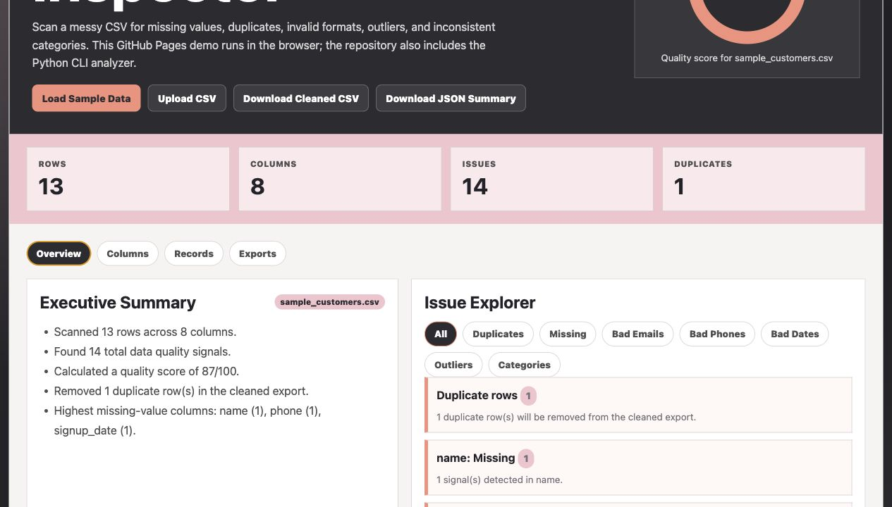

# CleanSight

CleanSight is a Python data quality inspector for messy CSV files. I built it to show practical Python automation: reading business data, finding quality issues, creating a cleaned export, and generating a polished report someone could actually use.



## Live Demo

Use the interactive GitHub Pages demo:

https://briannab1997.github.io/BB-CleanSight/

The live demo runs in the browser and lets users load sample data, upload a CSV, click through issue filters, inspect columns, preview flagged records, and download cleaned CSV or JSON outputs.

## Why I Built It

Almost every organization has messy data somewhere. CleanSight focuses on the kind of cleanup work that helps teams trust their reports: missing values, duplicates, invalid formats, inconsistent categories, and unusual numeric values.

The project is intentionally not tied to one industry. It could apply to customer data, operations exports, support records, inventory files, enrollment lists, or any CSV that needs a quick quality review.

## What It Checks

- Missing values by column
- Duplicate rows
- Invalid dates
- Invalid email formats
- Invalid phone formats
- Numeric outliers
- Inconsistent category casing or spacing
- Rare category values

## What It Generates

- Styled HTML data quality report
- Interactive GitHub Pages demo
- Cleaned CSV export with duplicates removed
- JSON summary for downstream automation
- CLI summary in the terminal

## Color Direction

The report uses a charcoal, graphite, silver, rose, and coral palette:

- `#2C2B30`
- `#4F4F51`
- `#D6D6D6`
- `#F2C4CE`
- `#F58F7C`

## Run Locally

```bash
python3 analyze.py data/sample_customers.csv \
  --report reports/cleansight-report.html \
  --cleaned reports/cleaned-data.csv \
  --json reports/cleansight-summary.json
```

## Run Tests

```bash
python3 -m unittest discover -s tests
```

## Example Output

```text
CleanSight scanned 13 rows and found 14 quality signals.
Quality score: 87/100
Report: reports/cleansight-report.html
Cleaned CSV: reports/cleaned-data.csv
```

## Tech Stack

- Python
- CSV parsing
- Standard-library testing with `unittest`
- HTML report generation
- JSON summary export

## Portfolio Note

CleanSight shows Python beyond syntax basics: file handling, validation logic, reporting, test coverage, automation-friendly outputs, and business-focused communication.
